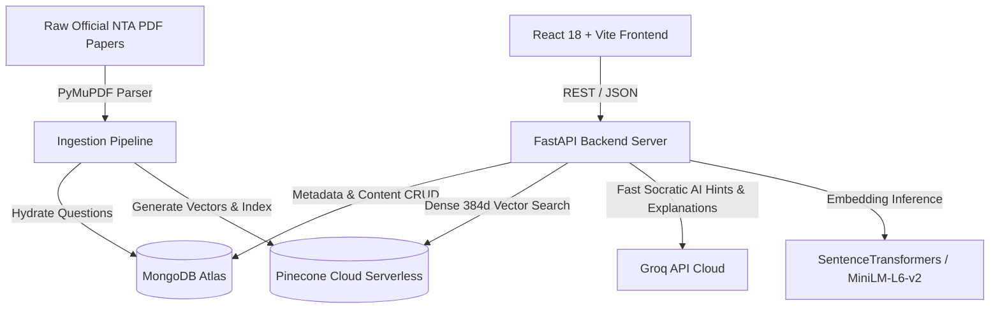

# 🎯 Qnexus — AI-Powered JEE Main PYQ Intelligence Platform

[](https://fastapi.tiangolo.com)
[](https://react.dev)
[](https://vitejs.dev)
[](https://tailwindcss.com)
[](https://www.mongodb.com/)
[](https://www.pinecone.io/)
[](https://groq.com/)

**Qnexus** is an intelligent Previous Year Questions (PYQ) analytics and practice platform designed for JEE Main aspirants. It transforms raw shift exam papers into an interactive, semantically indexed learning experience powered by dense vector search, an AI Socratic tutor, adaptive practice sessions, and automated weakness detection.

---

## 🚀 Key Features

* **🔍 Semantic & Multi-Faceted PYQ Search**:
  * Dense 384-dimensional vector retrieval using `sentence-transformers/all-MiniLM-L6-v2` hosted on **Pinecone Serverless Cloud**.
  * Filter questions by Subject (*Physics, Chemistry, Mathematics*), Chapter, Concept, Difficulty (*Easy, Medium, Hard*), Year (2024–2026), Session, and Shift.
* **🤖 AI Socratic Tutor & Hint Drawer**:
  * Powered by ultra-fast LLM inference via **Groq** (`llama-3.3-70b-versatile` / `qwen/qwen3.8-27b`).
  * Offers adaptive, step-by-step conceptual hints without immediately revealing final answers, fostering active recall.
* **📝 Interactive Practice Mode**:
  * Shift-wise paper simulations and topic-specific practice drills.
  * Real-time answer validation, detailed solution breakdowns, diagram displays, and $\LaTeX$ formula rendering via **KaTeX**.
* **📊 Performance Analytics & Radar Insights**:
  * Track chapter-wise accuracy, time allocation per question, and conceptual blindspots.
* **📕 Smart Mistake Notebook**:
  * Automatically flags incorrectly solved questions.
  * Categorizes errors (*Calculation, Conceptual, Misread*) and schedules targeted revision.
* **📑 Automated Paper Ingestion Pipeline**:
  * Built-in PDF parsing pipeline with **PyMuPDF** that parses questions, answer keys, diagrams, and aligns them against the official JEE Main syllabus taxonomy.

---

## 🏗️ System Architecture



---

## 📂 Project Structure

```
qnexus/
├── backend/                        # FastAPI Application
│   ├── app/
│   │   ├── api/v1/                 # API Routes (search, ai, questions, practice, etc.)
│   │   ├── core/                   # Config, DB clients (MongoDB, Pinecone), Security
│   │   ├── models/                 # Pydantic & DB entity definitions
│   │   ├── parsers/                # Year-wise shift PDF & answer key parsers (2024-2026)
│   │   ├── repositories/           # Database access layer
│   │   ├── schemas/                # Request & response Pydantic schemas
│   │   ├── services/               # Core business logic (Search, AI, Ingestion, Embeddings)
│   │   └── utils/                  # ID generators, diagram helpers
│   ├── data/                       # Syllabus JSON and processed schema data
│   ├── requirements.txt            # Python dependencies
│   └── run_tests.py                # Test runner
├── frontend/                       # React + Vite Single Page Application
│   ├── src/
│   │   ├── components/             # Reusable UI cards, modals, math renderers, filters
│   │   ├── pages/                  # Search, Practice, Papers, Dashboard, Analytics, Mistakes
│   │   ├── services/               # Axios API clients
│   │   └── data/                   # Navigation and static options
│   ├── package.json                # Frontend dependencies
│   ├── tailwind.config.js          # Tailwind styling configuration
│   └── vite.config.js              # Vite build setup
├── data/                           # Extracted & processed dataset files
└── scripts/                        # Ingestion, embedding generation, and Pinecone sync scripts
```

---

## 🛠️ Tech Stack

| Component | Technology |
| :--- | :--- |
| **Frontend** | React 18, Vite, Tailwind CSS, Lucide React, KaTeX / React-KaTeX, Recharts |
| **Backend** | Python 3.11+, FastAPI, Pydantic v2, Uvicorn |
| **Databases** | MongoDB Atlas (Documents/Questions), Pinecone Serverless (Vector Index) |
| **AI / ML** | Sentence-Transformers (`all-MiniLM-L6-v2`), Groq SDK (`llama-3.3-70b-versatile` / `qwen`) |
| **PDF Processing** | PyMuPDF (fitz) |

---

## ⚡ Quick Start

### 1. Prerequisites
* **Python** 3.11 or higher
* **Node.js** 18+ and **npm**
* Accounts and API keys for:
  * [MongoDB Atlas](https://www.mongodb.com/cloud/atlas) (Free M0 cluster)
  * [Pinecone Cloud](https://www.pinecone.io/) (Free Serverless Index)
  * [Groq Cloud Console](https://console.groq.com/) (Free inference key)

---

### 2. Backend Setup

```bash
# Navigate to backend directory
cd backend

# Create and activate virtual environment
# Windows (PowerShell):
python -m venv venv
.\venv\Scripts\Activate.ps1

# Linux / macOS:
# python -m venv venv && source venv/bin/activate

# Install dependencies
pip install -r requirements.txt

# Configure environment variables
cp .env.example .env
```

Edit `backend/.env` with your actual credentials:
```env
PROJECT_NAME="Qnexus Backend"
PORT=8000
MONGODB_URL="mongodb+srv://<username>:<password>@cluster0.mongodb.net/?appName=Cluster0"
MONGODB_DB_NAME="qnexus_db"
PINECONE_API_KEY="pcsk_your_pinecone_key"
PINECONE_INDEX_NAME="qnexus-questions"
PINECONE_CLOUD="aws"
PINECONE_REGION="us-east-1"
GROQ_API_KEY="gsk_your_groq_key"
GROQ_MODEL="llama-3.3-70b-versatile"
EMBEDDING_MODEL_NAME="sentence-transformers/all-MiniLM-L6-v2"
FRONTEND_URL="http://localhost:5173"
```

Start the backend server:
```bash
uvicorn app.main:app --reload
```
* Interactive Swagger Docs: [http://localhost:8000/docs](http://localhost:8000/docs)
* Health Check: [http://localhost:8000/api/v1/health](http://localhost:8000/api/v1/health)

---

### 3. Frontend Setup

Open a second terminal:
```bash
# Navigate to frontend directory
cd frontend

# Install dependencies
npm install

# Configure environment variables (optional, defaults to http://localhost:8000/api/v1)
cp .env.example .env
```

Ensure `frontend/.env` contains:
```env
VITE_API_BASE_URL=http://localhost:8000/api/v1
```

Start the frontend development server:
```bash
npm run dev
```
Open your browser at [http://localhost:5173](http://localhost:5173).

---

## 📥 Ingestion & Vector Embedding Scripts

To seed or sync questions and vector embeddings from raw shift papers:

```bash
# Ingest and embed 2024 shift papers
python scripts/ingest_and_embed_2024.py

# Ingest and embed 2025 shift papers
python scripts/ingest_and_embed_2025.py

# Synchronize all question vectors to Pinecone
python scripts/sync_pinecone.py
```

---

## 🔌 API Endpoints Summary

| Method | Endpoint | Description |
| :--- | :--- | :--- |
| `GET` | `/api/v1/health` | Service health status check |
| `POST` | `/api/v1/search` | Semantic vector search with multi-attribute filtering |
| `GET` | `/api/v1/questions` | Paginated question catalog with facet filters |
| `GET` | `/api/v1/questions/{id}` | Detailed question document with answers and solutions |
| `GET` | `/api/v1/papers` | Official shift papers directory |
| `POST` | `/api/v1/ai/hint` | Socratic hint generation for a question |
| `POST` | `/api/v1/ai/explain` | Comprehensive conceptual step-by-step breakdown |
| `POST` | `/api/v1/practice/submit`| Validate answer submission and update session history |
| `GET` | `/api/v1/analytics/summary`| Subject and chapter-level performance analytics |
| `GET` | `/api/v1/mistakes` | Retrieve bookmarked mistakes and tagged weaknesses |

---

## 🌐 Deployment Guide

### Option 1: Full Deployment on Render
1. **Backend (Web Service)**:
   * **Root Directory**: `backend`
   * **Environment**: `Python 3`
   * **Build Command**: `pip install -r requirements.txt`
   * **Start Command**: `uvicorn app.main:app --host 0.0.0.0 --port $PORT`
   * Add all `.env` keys in the Render Environment tab.

2. **Frontend (Static Site)**:
   * **Root Directory**: `frontend`
   * **Build Command**: `npm install && npm run build`
   * **Publish Directory**: `dist`
   * **Environment Variable**: `VITE_API_BASE_URL=https://<your-backend>.onrender.com/api/v1`

---

### Option 2: Render (Backend) + Vercel (Frontend) *(Recommended)*
* Deploy the **backend** on Render as a Web Service.
* Deploy the **frontend** on Vercel:
  * Framework Preset: `Vite`
  * Root Directory: `frontend`
  * Add Environment Variable: `VITE_API_BASE_URL=https://<your-backend>.onrender.com/api/v1`

---

## 📄 License
This project is licensed under the [MIT License](LICENSE).
